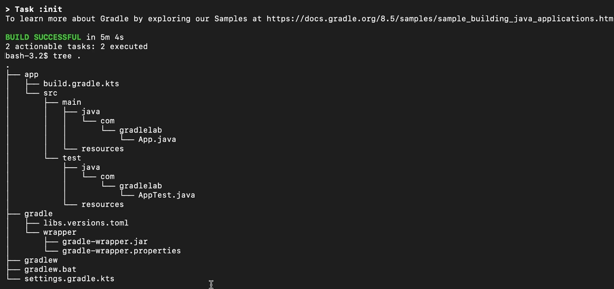
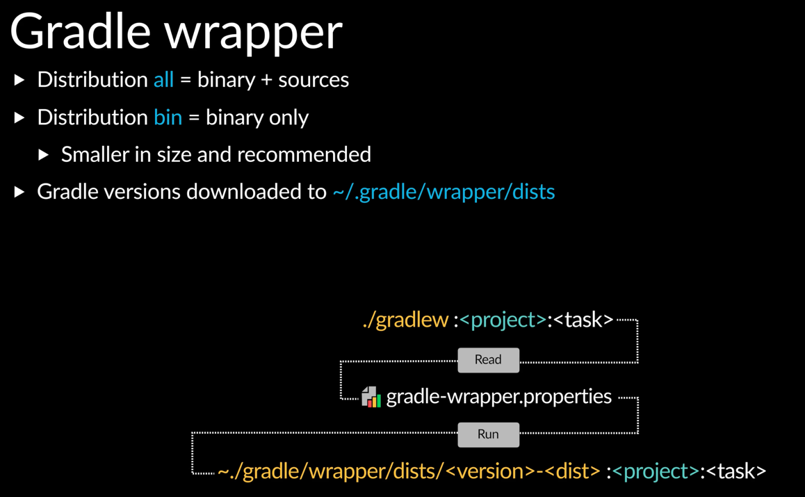
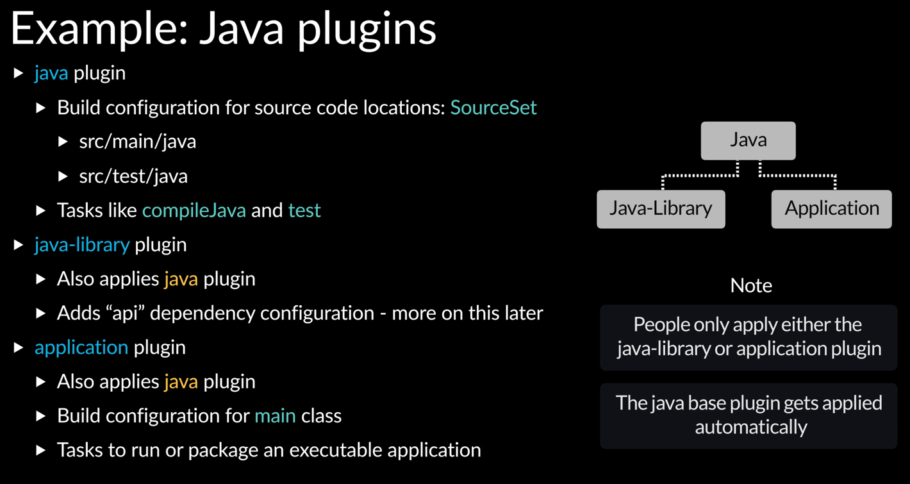
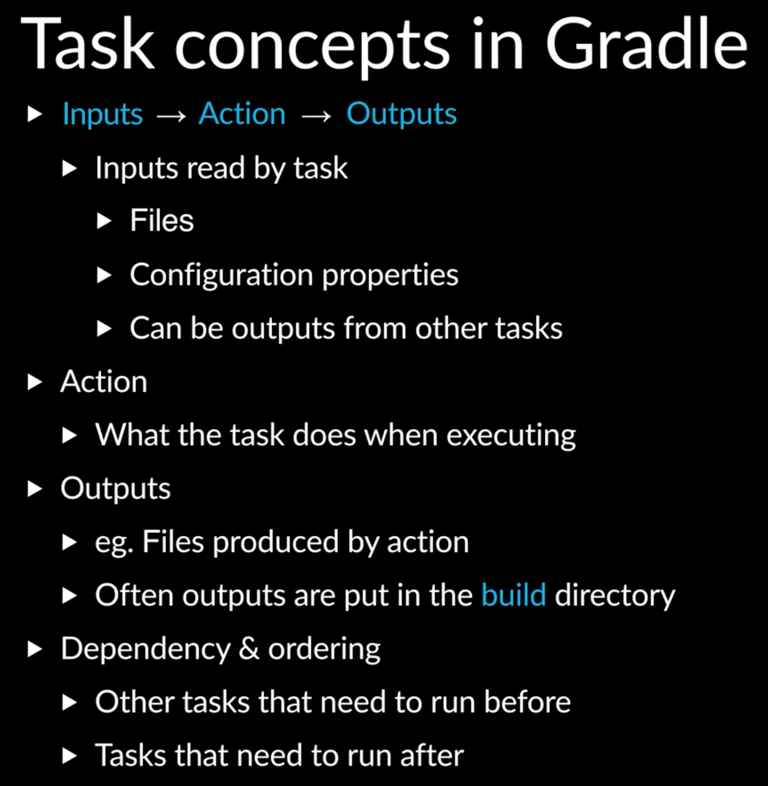
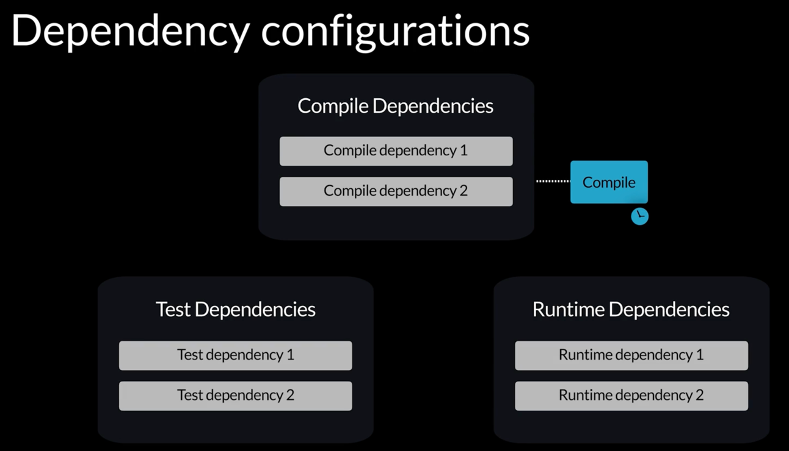

# Highligts of project
[Multithread code perfomance increase up to 9x](../../../../../screenshots/multithreadPerformance.png)

# Install SDKman
Link:
https://sdkman.io/install/

MacOS installation:
- curl -s "https://get.sdkman.io" | zsh

For Gradle compatibility:
- sdk install java 21.0.2-open
- java -version

# Java Networking resource
Link:
https://github.com/PrashDev425/network-programming

# Java multithread resource
Modern Concurrency in Java: Virtual Threads, Structured Concurrency, and Beyond By A N M Bazlur Rahman

# Clean Build folder, Compile Fat Jar and Run it
- ./gradlew clean
- ./gradlew shadowJar
- java -jar build/libs/static_page-1.0-SNAPSHOT-all.jar

# Learn Gradle
## More resource on Gradle
Link:
https://koge.2bab.com/

## Introduction to Gradle for Developers Prerequisites
Link:
https://dpeuniversity.gradle.com/learning_paths/1a2955ed-499e-45e3-af54-9babd8427972/courses/012de84f-fcd3-45d4-9c4c-284382eb3f3f/activities/3dd8606c-d436-4962-bb02-0f8c613ab5db

Link:
https://dpeuniversity.gradle.com/learning_paths/1a2955ed-499e-45e3-af54-9babd8427972/courses/012de84f-fcd3-45d4-9c4c-284382eb3f3f/activities/8450493b-7c4f-498d-9fe4-f3acd1af323a

There are two files
- settings.gradle.kts
- build.gradle.kts

Command to start a gradle project
- gradle init

If we are building an executable app, pick 2:application
If we are creating a library that will be used by others, pick 3:library
If we are building gradle plugin to offer more functionality, pick 4:gradle plugin
If we pick 1: basic, this gradle will create a basic layout and configuration, this is the default option

if we are asked how many subprojects will be in our application, we will specify "no" to indicate only 1

For the demo video:
project name: calc
source package name: com.gradlelab

[Gradle Init result](../../../../../screenshots/gradleinit.png)

[Gradle w command](../../../../../screenshots/gradlewCommand.png)

[Java related Plugins](../../../../../screenshots/JavaRelatedPlugins.png)

- ./gradlew tasks --all

add gradle.properties file to make .gradlew command output more information

[tasks concepts](../../../../../screenshots/tasksConcepts.png)

- ./gradlew :compileJava
- ./gradlew :cleanCompileJava

[different dependencies](../../../../../screenshots/differentDependencies.png)

